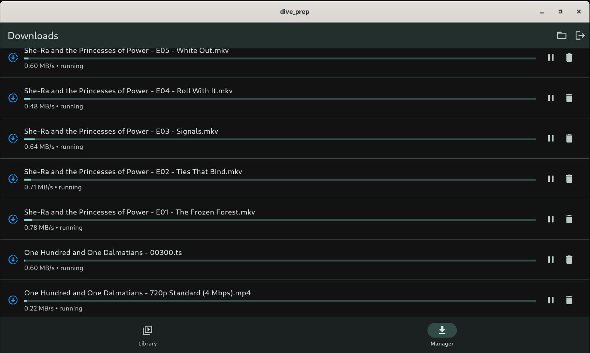
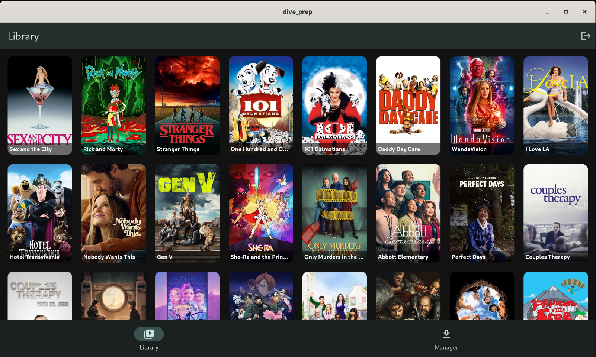

# dive_prep

<p align="center">
  
</p>

I always was bothered that Jellyfin didn't support transcoded downloads. So I
built a little app as a stopgap until they actually build this out in the real
app.

 

## Usage

```
git clone https://github.com/lukehmcc/dive-prep.git
cd dive-prop
flutter run
```

It should work on all platforms. But file a PR if you have an issue.
